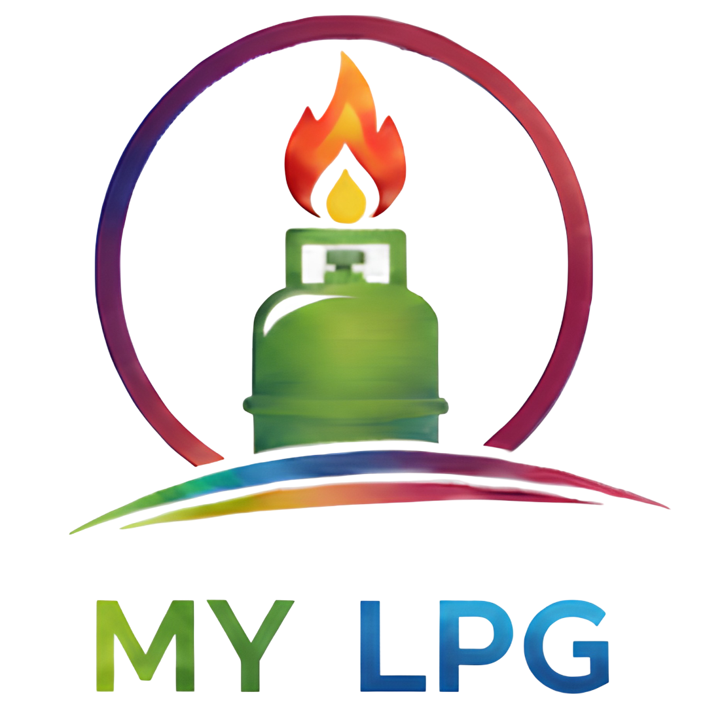
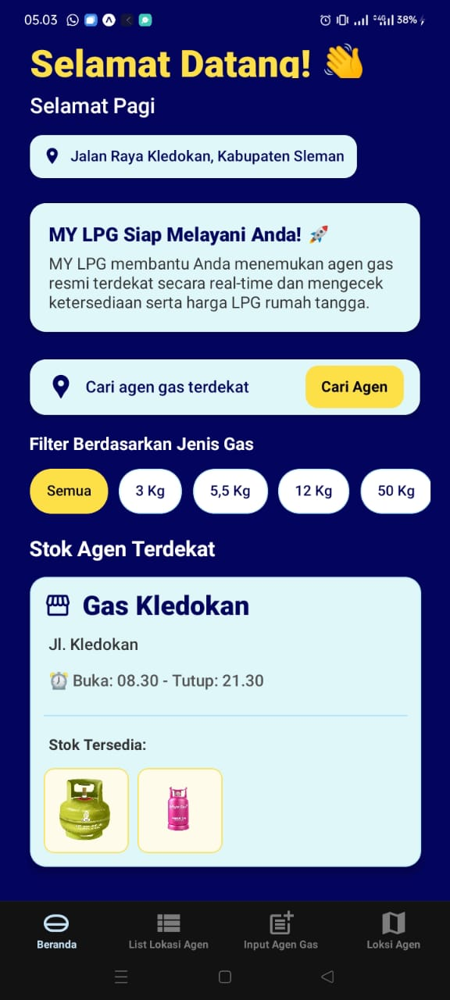
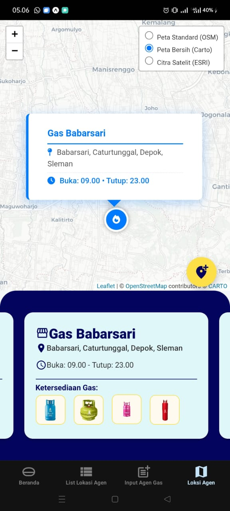
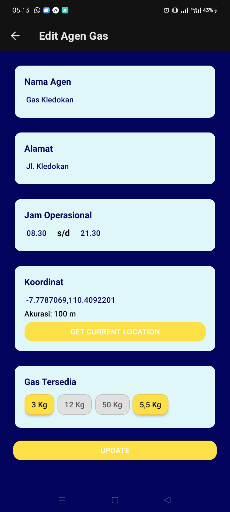
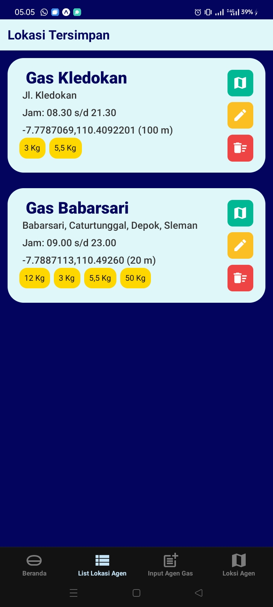

# 🚀 MY LPG (Gassin)
  
 
> *Solusi Cerdas Menemukan Agen Gas Terdekat Secara Real-Time.*

## 📱 Deskripsi Produk

**MY LPG** adalah aplikasi mobile berbasis React Native yang dirancang untuk memudahkan masyarakat dalam mencari agen gas LPG resmi terdekat. Aplikasi ini menjawab masalah ketidakpastian stok dan lokasi agen gas di sekitar pengguna.

Dengan integrasi **Peta Interaktif** dan **Geolokasi**, pengguna dapat melihat posisi agen, mengecek ketersediaan jenis gas (3 Kg, 5.5 Kg, 12 Kg, 50 Kg), melihat jam operasional, serta mendapatkan rute langsung ke lokasi agen. Aplikasi ini juga dilengkapi fitur manajemen data bagi admin untuk menambah atau memperbarui informasi agen secara *real-time*.

---

## ✨ Fitur yang Tersedia

Aplikasi ini memiliki fitur lengkap untuk Pengguna maupun Pengelola Agen:

### 🌍 Untuk Pengguna:
- **Deteksi Lokasi Otomatis:** Menampilkan lokasi pengguna saat ini secara akurat.
- **Pencarian Agen Terdekat:** Menemukan agen gas di sekitar pengguna dengan radius tertentu.
- **Filter Jenis Gas:** Memfilter agen berdasarkan ketersediaan stok (3 Kg, 5,5 Kg, 12 Kg, 50 Kg).
- **Informasi Detail Agen:** Menampilkan nama, alamat, jam buka/tutup, dan harga/stok gas.
- **Peta Interaktif:** Tampilan visual menggunakan peta (Leaflet/OSM) dengan custom marker.
- **Navigasi Rute:** Integrasi langsung ke Google Maps untuk petunjuk arah.

### 🛠 Untuk Pengelola (Admin):
- **Input Agen Baru:** Formulir mudah untuk mendaftarkan agen baru beserta koordinat lokasi.
- **Update Data Agen:** Mengubah informasi stok, harga, atau jam operasional.
- **Hapus Data Agen:** Menghapus agen yang sudah tidak aktif.
- **Ambil Koordinat GPS:** Fitur *Get Current Location* saat input data agen untuk akurasi tinggi.

---

## 🏗 Komponen Pembangunan Produk (Tech Stack)

Aplikasi ini dibangun menggunakan teknologi modern untuk performa yang cepat dan ringan:

| Komponen | Teknologi yang Digunakan |
| :--- | :--- |
| **Framework** | [React Native](https://reactnative.dev/) (via Expo SDK) |
| **Language** | [TypeScript](https://www.typescriptlang.org/) |
| **Navigation** | [Expo Router](https://docs.expo.dev/router/introduction/) |
| **Database** | [Firebase Realtime Database](https://firebase.google.com/) |
| **Maps & Webview** | [React Native Webview](https://github.com/react-native-webview/react-native-webview) & [Leaflet JS](https://leafletjs.com/) |
| **Location Services** | Expo Location |
| **Icons** | Material Icons (Expo Vector Icons) |
| **Styling** | React Native StyleSheet & Themed Components |

---

## 📊 Sumber Data

Data aplikasi ini bersifat **Real-time** dan bersumber dari:

1.  **Firebase Realtime Database:** Menyimpan seluruh data agen (Nama, Alamat, Koordinat, Stok Gas, Jam Operasional) dalam struktur JSON tree (`/agents`).
2.  **OpenStreetMap (OSM) & CartoDB:** Menyediakan *basemap* untuk tampilan peta visual.
3.  **Expo Location API:** Mengambil data geolokasi pengguna (Latitude/Longitude) untuk perhitungan jarak dan penanda lokasi.

---

## 📱 Halaman Aplikasi

Berikut adalah struktur navigasi dan tampilan utama aplikasi:

### 1. 🏠 Beranda (Home Page)
Halaman utama yang menyapa pengguna berdasarkan waktu (Pagi/Siang/Sore/Malam).
*   **Fitur:** Menampilkan lokasi pengguna saat ini, tombol cari agen cepat, filter kategori gas (slider horizontal), dan daftar kartu agen terdekat beserta status stoknya.
*   **Visual:** Menggunakan *Parallax Scroll View* yang estetis.

### 2. 🗺️ Lokasi Agen (Interactive Map)
Tampilan peta penuh (WebView) yang memuat file HTML Leaflet custom.
*   **Fitur:** Marker interaktif untuk setiap agen. Klik marker untuk melihat *popup* info singkat.
*   **Daftar Bawah:** *Horizontal scroll* daftar agen. Jika kartu agen diklik, peta otomatis *zoom* ke lokasi tersebut.

### 3. 📝 Input Agen Gas
Formulir untuk menambahkan data agen baru ke database.
*   **Input:** Nama Agen, Alamat Lengkap, Jam Operasional (Buka/Tutup).
*   **Koordinat:** Input manual atau tombol otomatis **"Get Current Location"** (mengambil lat/long perangkat).
*   **Stok:** Pilihan *toggle* jenis gas yang tersedia (Badge selector).

### 4. 📋 List Lokasi Agen (Manajemen)
Halaman daftar lengkap seluruh agen yang tersimpan di database.
*   **Aksi:** 
    *   🔵 **Lihat Peta:** Membuka Google Maps untuk rute.
    *   🟡 **Edit:** Membuka form edit untuk memperbarui data.
    *   🔴 **Hapus:** Menghapus data agen dari database (dengan konfirmasi).
*   **Fitur Tambahan:** *Pull-to-refresh* untuk memperbarui data list.

## 📸 Tampilan Aplikasi (Preview)

Berikut adalah antarmuka pengguna dari aplikasi MY LPG:

| **Halaman Beranda** | **Peta Lokasi Agen** |
|  |  |
| **Input Agen Baru** | **Edit Location** |
|  |  |
| **List data dengan opsi Edit & Hapus**|
|  |


## 🚀 Cara Menjalankan Aplikasi

1.  **Clone Repository**
    ```bash
    git clone https://github.com/username/my-lpg-gassin.git
    cd my-lpg-gassin
    ```

2.  **Install Dependencies**
    ```bash
    npm install
    # atau
    yarn install
    ```

3.  **Jalankan Aplikasi**
    ```bash
    npx expo start
    ```

4.  **Scan QR Code**
    Gunakan aplikasi **Expo Go** di Android/iOS untuk menjalankan aplikasi.

---

<p align="center">
  Dibuat oleh Alifah Khairur Rizky
</p>
